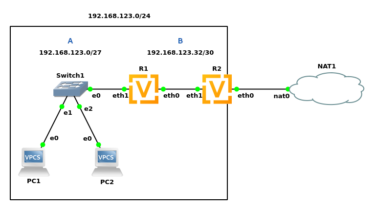

### Net topology



- NAT on router **R2**  _eth0_
- DHCP on **R1** _eth1_
- DNS forwarding **R1** -> **R2** -> internet 

### Subnets address space

#### Subnet A

address space: `192.168.123.0/27`\
max 30 hosts\
min address: `192.168.123.1`\
max address: `192.168.123.30`

##### nodes:

|||
|----------|--------------------|
| **R1**   | `192.168.123.1/27` |
| **PC1**  | DHCP from R1       |
| **PC2**  | DHCP from R1       |

#### Subnet B

address space: `192.168.123.32/30`
max 2 hosts\
min address: `192.168.123.33`\
max address: `192.168.123.34`

##### nodes:

|||
|----------|--------------------|
| **R1**   | `192.168.123.34/30` |
| **R2**   | `192.168.123.33/30` |

### Nodes configuration
#### R1 - VyOS 1.3
```
configure

set interfaces ethernet eth0 address 192.168.123.34/30
set interfaces ethernet eth1 address 192.168.123.1/27

# Route to outer internet
set protocols static route 0.0.0.0/0 next-hop 192.168.123.33

# DHCP server
set service dhcp-server shared-network-name LAN subnet 192.168.123.0/27 default-router 192.168.123.1
set service dhcp-server shared-network-name LAN subnet 192.168.123.0/27 dns-server 192.168.123.1
set service dhcp-server shared-network-name LAN subnet 192.168.123.0/27 lease '86400'
set service dhcp-server shared-network-name LAN subnet 192.168.123.0/27 range 0 start 192.168.123.2
set service dhcp-server shared-network-name LAN subnet 192.168.123.0/27 range 0 stop 192.168.123.30

# DNS forwarding
set service dns forwarding name-server 192.168.123.33
set service dns forwarding cache-size 0
set service dns forwarding listen-address 192.168.123.1
set service dns forwarding allow-from 192.168.123.0/27

commit
save
exit
```

#### R2 - VyOS 1.3
```
configure
set interfaces ethernet eth0 address dhcp
set interfaces ethernet eth1 address 192.168.123.33/30

# NAT
set nat source rule 1 outbound-interface eth0
set nat source rule 1 source address 192.168.123.0/24
set nat source rule 1 translation address masquerade

# Route to A
set protocols static route 192.168.123.0/27 next-hop 192.168.123.34

# DNS forwarding
set service dns forwarding dhcp eth0
set service dns forwarding cache-size '0'
set service dns forwarding listen-address 192.168.123.33
set service dns forwarding allow-from 192.168.123.32/30

commit
save
exit
```

#### PC1
```
PC1> ip dhcp
PC1> save
```

#### PC2
```
PC2> ip dhcp
PC2> save
```